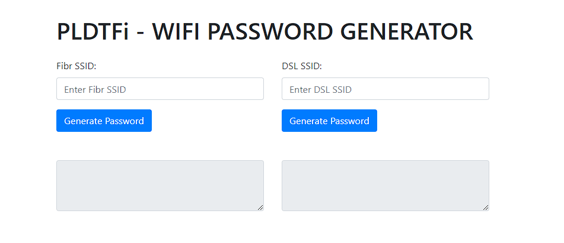

# PLDTFi - WIFI PASSWORD GENERATOR

## SETUP
```bash
git clone https://github.com/Team-Learning-Session/PLTDFi
cd PLTDFi
pip3 install -r requirements.txt
python3 PLTDFi.py
```
Open in your browswer:  `http://127.0.0.1:5000/`

## Documentation
### DSL
```
    Sample #1 
        SSID: PLDTWIFI52374
        GET THE LAST 5 DIGITS
        52374 x 3 is equal 157122 
        Result: PLDTWIFI157122 

    Sample #2 
        SSID: PLDTHOMEDSL57341 
        GET THE LAST 5 DIGITS
        57341 x 3 is equal 172023
        Result: PLDTWIFI172023
```

### FIBER
Convert the last 5 character of the PLDTWIFI SSID to Hexadecimal Characters


```
    SAMPLE #1
        SSID PLDTHOMEFIBRb4870 
        CONVERT THE LAST 5 DIGITS TO THE IMAGE ABOVE
        b4870 is 4b78f
        [ PLDTWIFI + "generated Mac address" ] 
        b = 4
        4 = b
        8 = 7
        7 = 8
        0 = f 
        So you get 4b78f
        Result: PLDTWIFI4B78F
```
Full document: `https://www.coursehero.com/file/43638965/wifi-hackingdocx/`

## DISCLAIMER: 
This project and its documentation were created for educational purposes only. The content and information provided in this project are based on publicly available sources, including but not limited to the document located at `https://www.coursehero.com/file/43638965/wifi-hackingdocx/`. The purpose of this project is to demonstrate technical skills and should not be used for any malicious, unauthorized, or illegal activities. 

The creators and contributors of this project do not endorse or promote any form of hacking, unauthorized access to computer networks, or any other illegal activities. Any use of the knowledge or tools presented in this project for illegal or unethical purposes is strictly discouraged and is the sole responsibility of the individual engaging in such activities.

By using this project and its documentation, you acknowledge that you are solely responsible for your actions and will use the information and tools provided in a legal and ethical manner. The creators and contributors of this project shall not be held liable for any misuse or illegal activities conducted by individuals using this project as a reference or resource.

Always adhere to local laws, regulations, and ethical standards when engaging in any form of computer or network-related activities.
